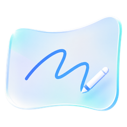
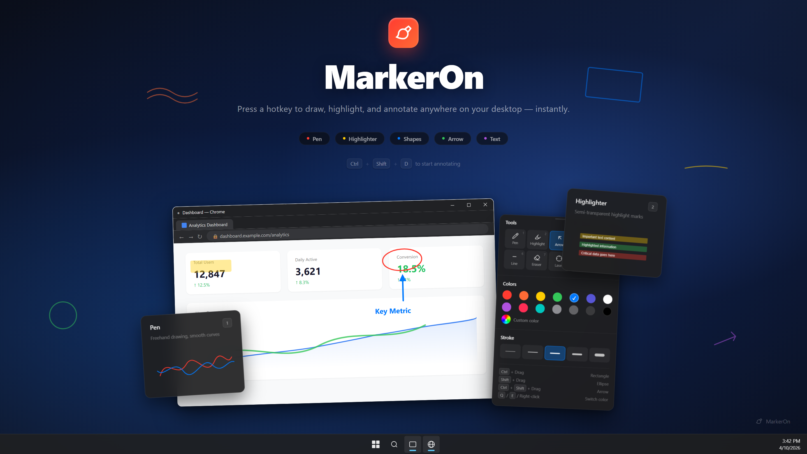
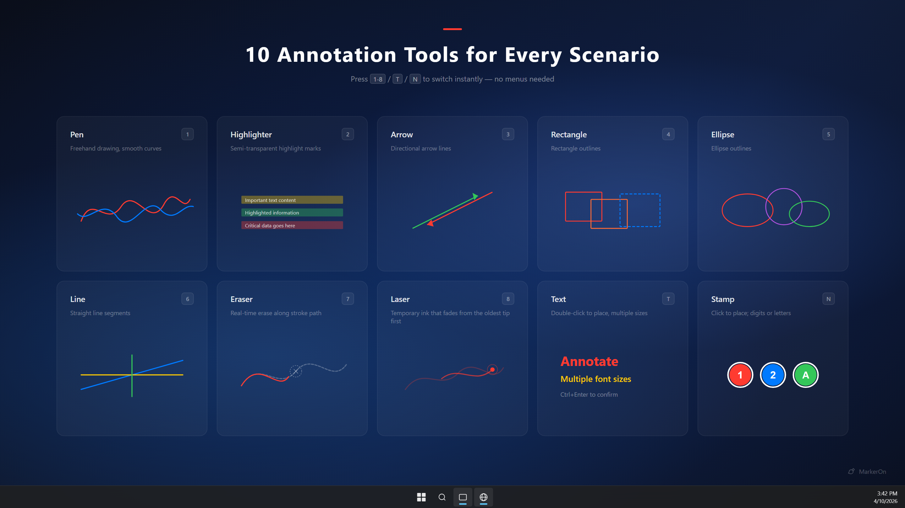
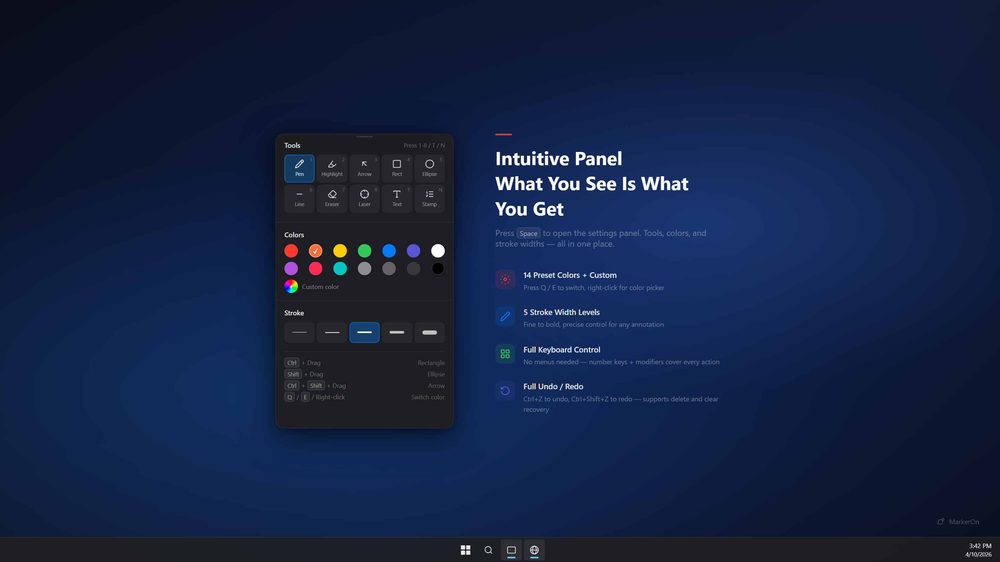

<div align="center">
  
  <h1>轻幕</h1>
  <p>
    <a href="./README_zh.md">中文</a>
  </p>
  <p>
    <a href="./LICENSE"></a>
    <a href="https://github.com/ifer47/markeron"></a>
    <a href="https://tauri.app/"></a>
  </p>
  <p><strong>Lightweight screen annotation tool</strong> (~6 MB installer) — press a hotkey (<strong>keyboard-first</strong>) to instantly draw, highlight, and annotate anywhere on your desktop. Built for demos, teaching, meetings, and screen recording. <strong>Open source under the MIT License.</strong></p>
</div>

<p align="center">
  
</p>

**Contents:** [Download](#download) · [Build from source](#build-from-source) · [Quick Start](#quick-start) · [Features](#features) · [Shortcuts](#keyboard-shortcuts) · [Feedback](#feedback--issues) · [Development](#development) · [Credits & license](#credits--license)

## Download

**Get builds from [GitHub Releases](https://github.com/jinyu-yjy-jinyu/qingmu/releases)**:

### Windows 64-bit

| Format | File | Notes |
| --- | --- | --- |
| Setup wizard | `qingmu_1.0.3_x64-setup.exe` | Recommended; double-click to install |
| MSI | `qingmu_1.0.3_x64_zh-CN.msi` | Good for enterprise deployment |
| MSIX | `qingmu_1.0.3_x64.msix` | Microsoft Store format |
| Portable | `lightcurtain_1.0.3_x64_portable.zip` | Unzip and run; nothing written to the registry |

### macOS 11+

| Chip | File |
| --- | --- |
| Apple Silicon (M-series) | `qingmu_1.0.3_aarch64.dmg` |
| Intel | `qingmu_1.0.3_x64.dmg` |

### Linux

No prebuilt packages yet — build from source below.

> ⚠️ **None of the builds are code-signed**, so the OS blocks the first launch:
>
> - **Windows**: SmartScreen warns about an unknown publisher → **More info → Run anyway**
> - **macOS**: Gatekeeper cannot verify the developer → **right-click the app → Open**,
>   or allow it under **System Settings → Privacy & Security → Open Anyway**

> 📝 **About the file names**: the product name is 轻幕, but GitHub release asset names may
> only contain ASCII, so artifacts use `qingmu_` / `lightcurtain_` prefixes. The installed
> app, Start-menu entry, and UI all remain in Chinese.

> The Gitee repository mirrors the source; **downloads should come from GitHub Releases**.

## Build from source

**Prerequisites**

- Node.js `24.15.0` (see `.nvmrc`, `.node-version`) and npm `11.12.1`
- [Rust](https://www.rust-lang.org/tools/install) (stable)
- Windows: Windows SDK · macOS: Xcode Command Line Tools

```bash
nvm install && nvm use   # or: fnm use
npm install
npm run dev              # Tauri dev app
npm run build            # production bundle
```

## Quick Start

1. **Install and launch** — 轻幕 runs in the **system tray**; no window appears.
2. **Enter annotation mode** — press <kbd>Ctrl</kbd> + <kbd>Shift</kbd> + <kbd>D</kbd> (<kbd>Command</kbd> + <kbd>Shift</kbd> + <kbd>D</kbd> on macOS).
3. **Draw, then click through** — use number keys for tools; press <kbd>X</kbd> to interact with apps below while keeping annotations visible; press <kbd>Esc</kbd> to exit.

> **New here?** Press <kbd>Space</kbd> for the toolbar. See [Keyboard Shortcuts](#keyboard-shortcuts) for the full list.

## Features

- **Lightweight & fast** — ~6 MB installer (Rust + Canvas, no bundled browser engine), minimal memory; runs quietly in the system tray (no extra daemons or telemetry)
- **Annotate anywhere** — draw over any app, including the taskbar
- **10 tools** — pen, highlighter, laser, arrow, rectangle, ellipse, line, eraser, text, stamp
- **Flexible toolbar** — press <kbd>Space</kbd> to toggle, or enable **always-on** in Settings; compact panel with **Expand** for full options, undo, copy, and whiteboard actions in-panel; **independent floating window** with drawing / click-through toggles
- **Click-through mode** — interact with apps below while staying in the session; toggle via toolbar buttons, <kbd>Ctrl</kbd>+<kbd>Shift</kbd>+<kbd>X</kbd> (global), or <kbd>X</kbd> while drawing; disabled in whiteboard mode
- **Full keyboard control** — every action has a shortcut, no menus needed
- **Preserve drawings** — enable **Keep after exit** under Whiteboard & content to resume on re-enter
- **Whiteboard mode** — set default entry to whiteboard, or press <kbd>W</kbd> to toggle; content rules are in **Whiteboard & content** settings
- **Whiteboard copy** — copy the whiteboard as an image with <kbd>Ctrl</kbd>/<kbd>Command</kbd> + <kbd>C</kbd>

<table>
<tr>
<td width="50%">

</td>
<td width="50%">

</td>
</tr>
</table>

## Keyboard Shortcuts

On **macOS**, use <kbd>Command</kbd> (⌘) in place of <kbd>Ctrl</kbd>, and <kbd>Option</kbd> (⌥) in place of <kbd>Alt</kbd>.

### Global Shortcuts

| Action | Windows | macOS |
| :--- | :--- | :--- |
| Toggle annotation mode | <kbd>Ctrl</kbd> + <kbd>Shift</kbd> + <kbd>D</kbd> | <kbd>Command</kbd> + <kbd>Shift</kbd> + <kbd>D</kbd> |
| Clear all annotations | <kbd>Ctrl</kbd> + <kbd>Shift</kbd> + <kbd>C</kbd> | <kbd>Command</kbd> + <kbd>Shift</kbd> + <kbd>C</kbd> |
| Toggle click-through mode | <kbd>Ctrl</kbd> + <kbd>Shift</kbd> + <kbd>X</kbd> | <kbd>Command</kbd> + <kbd>Shift</kbd> + <kbd>X</kbd> |

### Tool Switching

| Key | Tool | Key | Tool |
| :---: | :--- | :---: | :--- |
| <kbd>1</kbd> | Pen | <kbd>5</kbd> | Ellipse |
| <kbd>2</kbd> | Highlighter | <kbd>6</kbd> | Line |
| <kbd>3</kbd> | Arrow | <kbd>7</kbd> | Eraser |
| <kbd>4</kbd> | Rectangle | <kbd>8</kbd> | Laser |
| <kbd>T</kbd> | Text | <kbd>N</kbd> | Stamp |

### Common Actions

| Action | Windows | macOS |
| :--- | :--- | :--- |
| Toolbar (toggle) | <kbd>Space</kbd> | <kbd>Space</kbd> |
| Click-through (while drawing) | <kbd>X</kbd> | <kbd>X</kbd> |
| Toolbar always-on / layout | Settings → General | Settings → General |
| Copy screen / whiteboard | <kbd>Ctrl</kbd> + <kbd>C</kbd> | <kbd>Command</kbd> + <kbd>C</kbd> |
| Whiteboard toggle | <kbd>W</kbd> | <kbd>W</kbd> |
| Undo / Redo | <kbd>Ctrl</kbd> + <kbd>Z</kbd> / <kbd>Y</kbd> | <kbd>Command</kbd> + <kbd>Z</kbd> / <kbd>Y</kbd> |
| Stroke width | <kbd>Ctrl</kbd> + Scroll | <kbd>Command</kbd> + Scroll (pen, laser & shapes share; highlighter/eraser/text separate) |
| Exit | <kbd>Esc</kbd> | <kbd>Esc</kbd> |

<details>
<summary><strong>All shortcuts</strong></summary>

#### Drawing with Modifier Keys

| Draws | Windows | macOS |
| :--- | :--- | :--- |
| Current tool (default: pen) | Drag | Drag |
| Line | <kbd>Alt</kbd> + Drag | <kbd>Option</kbd> + Drag |
| Rectangle | <kbd>Ctrl</kbd> + Drag | <kbd>Command</kbd> + Drag |
| Square | <kbd>Ctrl</kbd> + <kbd>Alt</kbd> + Drag | <kbd>Command</kbd> + <kbd>Option</kbd> + Drag |
| Ellipse | <kbd>Shift</kbd> + Drag | <kbd>Shift</kbd> + Drag |
| Circle | <kbd>Shift</kbd> + <kbd>Alt</kbd> + Drag | <kbd>Shift</kbd> + <kbd>Option</kbd> + Drag |
| Arrow | <kbd>Ctrl</kbd> + <kbd>Shift</kbd> + Drag | <kbd>Command</kbd> + <kbd>Shift</kbd> + Drag |

#### Edit & Move

| Action | Effect |
| :--- | :--- |
| Element dragging | In General settings: **Off** / **Hover drag** / **Hold Ctrl to drag** |
| Double-click existing text | Re-enter **edit mode** for that text |
| Double-click empty area in <kbd>T</kbd> mode | Create a new text input at cursor position |

#### Color Switching

| Action | Effect |
| :--- | :--- |
| <kbd>Q</kbd> / <kbd>E</kbd> | Previous / Next color |
| Right-click | Hold to erase; release restores the previous tool |

#### Other

| Action | Windows | macOS |
| :--- | :--- | :--- |
| Redo (alt) | <kbd>Ctrl</kbd> + <kbd>Shift</kbd> + <kbd>Z</kbd> | <kbd>Command</kbd> + <kbd>Shift</kbd> + <kbd>Z</kbd> |

</details>

<details>
<summary><strong>Advanced settings</strong></summary>

In **Settings → General** (toolbar display, click-through, and stroke width — see [Features](#features)):

- **Whiteboard & content** — default entry (screen / whiteboard), keep after exit, keep on <kbd>W</kbd> toggle
- **Element dragging** — off, hover to drag, or hold <kbd>Ctrl</kbd>/<kbd>Command</kbd> to drag (disabled while eraser is selected)
- **Eraser mode** — stroke (local erase) or object (delete whole elements when passing over)
- **Angle snap step** — snap interval for straight lines drawn with <kbd>Alt</kbd>
- **Auto start** — launch the app automatically at system startup

</details>

## Feedback & Issues

- **Bug reports:** Settings → **Diagnostics** → export a report, then open a GitHub Issue on this repository
- **Privacy:** [PRIVACY.md](./PRIVACY.md)

## Development

See [CONTRIBUTING.md](./CONTRIBUTING.md) for prerequisites, setup, and the full workflow. **Stack:** Tauri v2 · Vue 3 · Vite · TypeScript · Rust · Canvas API

## Credits & license

轻幕 is a fork of **[MarkerOn](https://github.com/ifer47/markeron)** by ifer47, which is licensed under the MIT License.

- **License:** [MIT](./LICENSE) — applies to 轻幕
- **Upstream copyright:** Copyright (c) 2026 MarkerOn — preserved in [NOTICE](./NOTICE)
- **Dependency licenses:** [THIRD-PARTY-LICENSES.md](./THIRD-PARTY-LICENSES.md)

The MIT License requires that the original copyright notice and permission notice be retained in all copies or substantial portions of the software. Please keep `LICENSE` and `NOTICE` intact when you redistribute or fork this project.

Thanks to ifer47 and the MarkerOn contributors for the original work.
